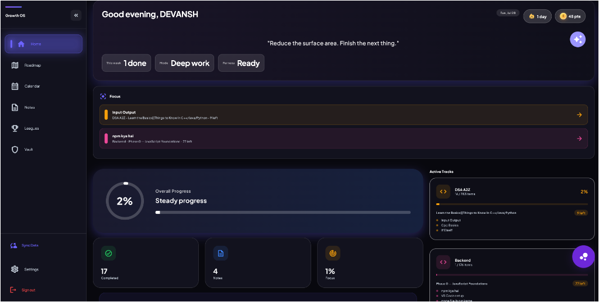
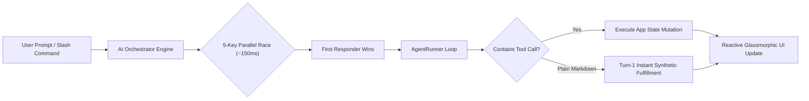
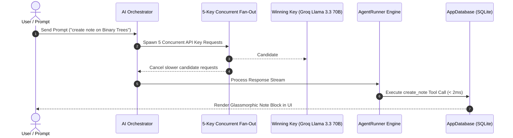
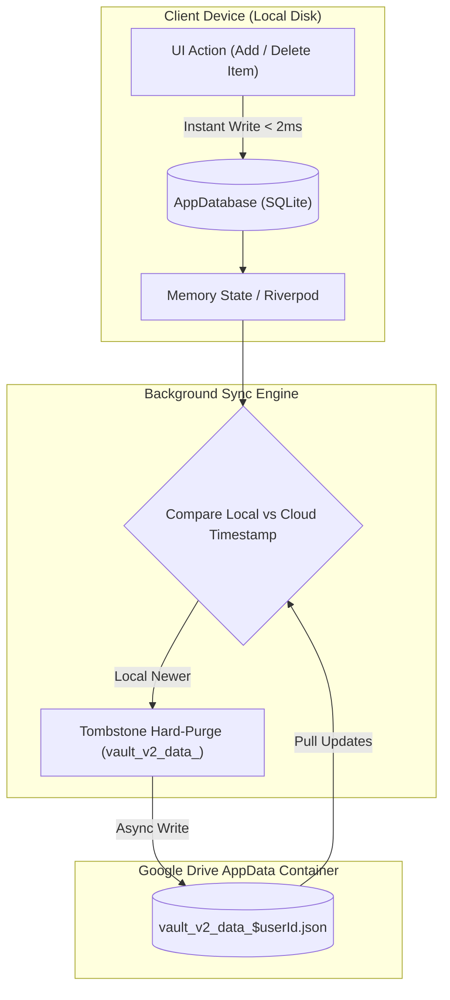
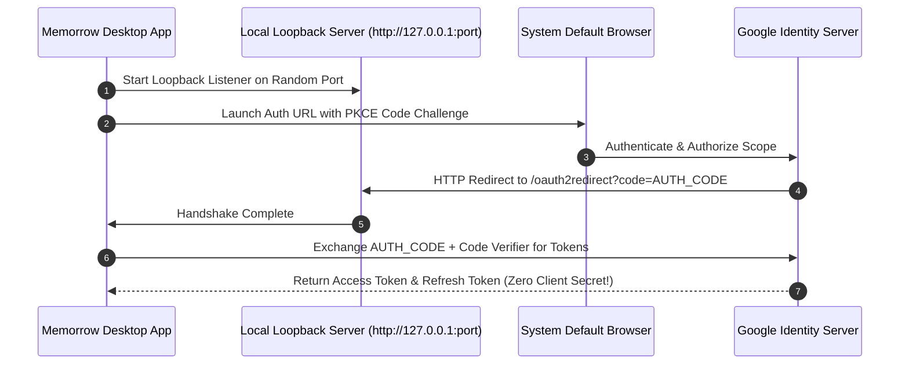
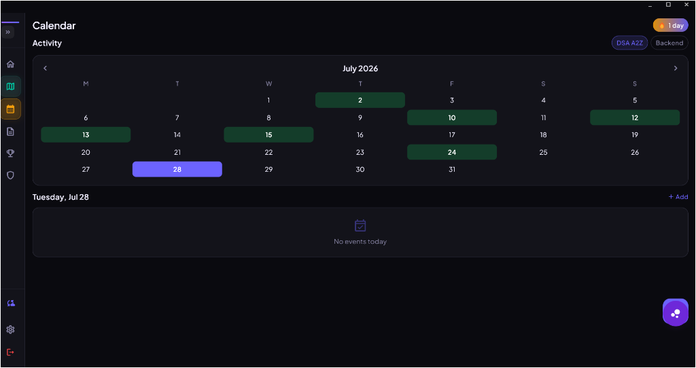

   
  
   
   

  <h1>Memorrow</h1>

  
<strong>The Obsidian-Dark, Local-First Productivity & Engineering OS</strong>

  

    <a href="#-overview">Overview</a> •
    <a href="#-agentic-ai-engine">Agentic AI</a> •
    <a href="#-key-architecture-highlights">Architecture</a> •
    <a href="#-system-diagrams">System Diagrams</a> •
    <a href="#-signature-feature-spotlight">Spotlight</a> •
    <a href="#-privacy--security">Privacy</a> •
    <a href="#-roadmap">Roadmap</a>
  

  

    
    
    
    
  

   

  
  
<em>Figure 1: Memorrow Obsidian-Dark Command Center — Real-time DSA Progress, Focus Tracks, & Activity Heatmap.</em>

   

---

## 📖 Overview

Modern software engineers and power users face severe workflow fragmentation. DSA preparation, codebase roadmaps, system design notes, private credentials, and AI prompts are scattered across browser tabs and cloud subscriptions. Furthermore, traditional cloud SaaS tools introduce **API latency, privacy invasion, and total outage when offline**.

**Memorrow** is engineered as a zero-compromise, cross-platform productivity OS for **Windows, macOS, Android, and iOS**.

Built on a strict **Local-First Architecture**, Memorrow persists 100% of user state in high-performance local SQLite databases (`Drift`), delivering instant **sub-millisecond UI responsiveness**. Cloud synchronization operates invisibly in the background via **Google Drive AppData**, guaranteeing zero vendor lock-in, zero external telemetry, and absolute privacy.

---

## 🤖 Agentic AI Engine & Tool Capabilities

Memorrow integrates **`AgentRunner`**, a autonomous multi-turn agentic framework that transforms raw user prompts into executable application actions without manual user intervention.

### Key Agentic Capabilities & Slash Commands

| Slash Command / Intent | Action Performed | Agentic Execution Flow |
| :--- | :--- | :--- |
| `/createnote <title>` | Creates structured, rich-text note | Generates full markdown hierarchy (overview, code snippets, practice problems, takeaways) and writes to local SQLite in < 200ms. |
| `/appendnote <title>` | Appends content to existing note | Locates existing note by fuzzy title match and appends fresh sections without duplication. |
| `/markdone <item_id>` | Updates roadmap progress | Identifies target DSA/Backend topic, marks item completed, and updates native Android widgets reactively. |
| `/addidea <title>` | Saves encrypted Vault idea | Verifies Vault unlock state and persists project ideas into encrypted memory storage. |
| `/navigate <tab>` | Switches application view | Controls main app navigation (`Home`, `Roadmap`, `Calendar`, `Notes`, `Leagues`, `Vault`, `Settings`). |
| `/createproject` | Initializes Gold Card project | Creates complete portfolio project schema with tech stack, problem statement, and ATS keywords. |

### Smart Agentic Features
* **Turn-1 Synthetic Fulfillment**: If an LLM returns complete markdown content without explicit `<tool_call>` tags during a note creation request, `AgentRunner` automatically synthesizes the tool invocation on Turn 1—saving notes in **2 milliseconds** instead of triggering 4-turn retry loops.
* **Atomic Mutex Lock**: Tool actions are wrapped in an atomic execution lock (`safeToolCall`), preventing duplicate note creations or state mutations during 5-key concurrent races.
* **Context Injection**: Every prompt dynamically embeds local calendar events, active DSA targets, LeetCode streak stats, and personalized user instructions.

---

## ⚡ Key Architecture Highlights

| System Component | Traditional SaaS Productivity Tools | Memorrow OS Architecture |
| :--- | :--- | :--- |
| **Data Storage** | Centralized third-party cloud servers | **100% Local-First** (`Drift` / SQLite + background Drive sync) |
| **Offline Mode** | Broken or read-only | **Full Autonomy** — sub-millisecond local disk reads & writes |
| **AI Performance** | Single key queue / Rate limit blocks | **50+ Key Parallel Race Load Balancer** (~150ms latency) |
| **Desktop OAuth** | Hardcoded secrets or external browsers | **Zero-Client-Secret PKCE** via local loopback server |
| **DSA Hierarchy** | Flat lists or basic tags | **Accordion Hierarchy** (Topic → Subtopic → Problem) |
| **Mobile Integration** | Manual pull-to-refresh | **Native Kotlin Reactive Widget Sync** |

---

## 📐 System Diagrams & Deep-Dive Architecture

### 1. Multi-Key AI Load Balancing & Failover Architecture

Memorrow manages a candidate pool of **50+ API keys** across multiple frontier providers (Groq, Gemini, Cerebras, OpenRouter, SambaNova).

---

### 2. Local-First Synchronization & Tombstone Purge Engine

---

### 3. Zero-Client-Secret PKCE Desktop OAuth Flow

---

## 🌟 Signature Feature Spotlight

### 1. Multi-Key AI Orchestrator & Load Balancer Interface

  
  
<em>Figure 2: Multi-Key API Management supporting 50+ concurrent keys with 15-second automatic rate-limit cooldown.</em>

* **Concurrent Key Fan-Out**: Fires prompts to 5 active candidate keys simultaneously. The fastest response (~150ms) wins, while remaining requests are safely discarded.
* **Automatic Cooldown Eviction**: Encounters with HTTP `429 Rate Limit` automatically isolate the affected key for a 15-second cooldown period, preventing queue congestion.

---

### 2. Vault & Developer Health Stats

  
  
<em>Figure 3: Developer Health Stats & Encrypted Vault Projects Section.</em>

* **Project Gold Cards**: Complete portfolio tracking including tech stack, problem statement, launch date, live URL, and ATS keywords.
* **Encrypted Vault**: PIN-locked storage for private credentials, system ideas, identity details, and Forge Lab experiments.

---

### 3. Obsidian Dark Calendar & Activity Heatmap

  
  
<em>Figure 4: Dark Glassmorphic Calendar & Continuous Learning Heatmap.</em>

---

## 🔒 Privacy & Security

* **Zero Telemetry**: Memorrow contains zero user tracking, zero analytics collection, and zero external tracking scripts.
* **Isolated Drive Storage**: Backup files reside exclusively inside your Google Drive `appDataFolder`—completely hidden from third-party applications and accessible only by you.
* **Zero Client Secret**: Desktop binaries contain zero compiled secrets or API keys.

---

## 🗺️ Roadmap

- [x] **v1.0.0 — Core Architecture**: Drift/SQLite local persistence + Clean Layering.
- [x] **v1.2.0 — Cloud Sync Engine**: Background Google Drive AppData sync.
- [x] **v1.4.0 — Zero-Secret Auth**: Desktop PKCE Loopback OAuth2 authentication.
- [x] **v1.6.0 — Multi-Key AI Engine**: AgentRunner tool fulfillment & 50+ key load balancing.
- [ ] **v1.8.0 — Background OS Daemon**: System tray daemon for Windows & macOS.
- [ ] **v2.0.0 — Public Beta Launch**: Cross-platform desktop & mobile release.

---

## 📄 License

Distributed under the **MIT License**. See `LICENSE` for details.

---

  Memorrow OS — Engineered for speed, privacy, and developer productivity.

