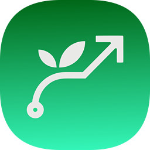
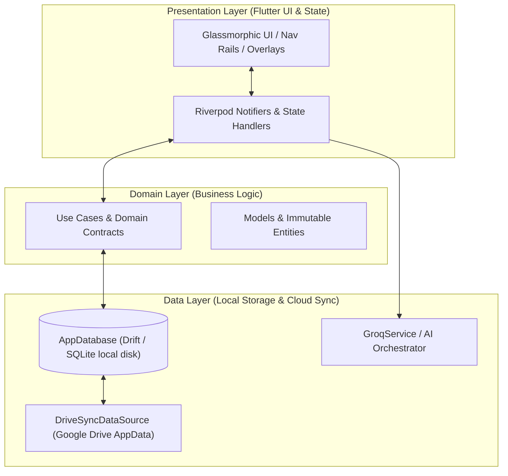
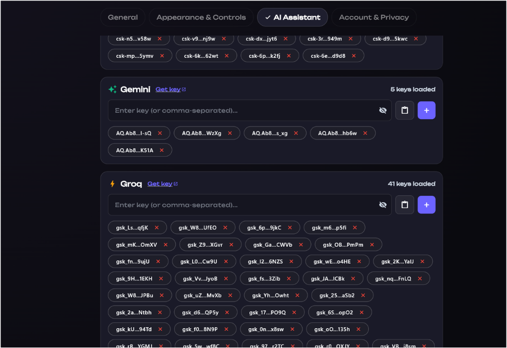
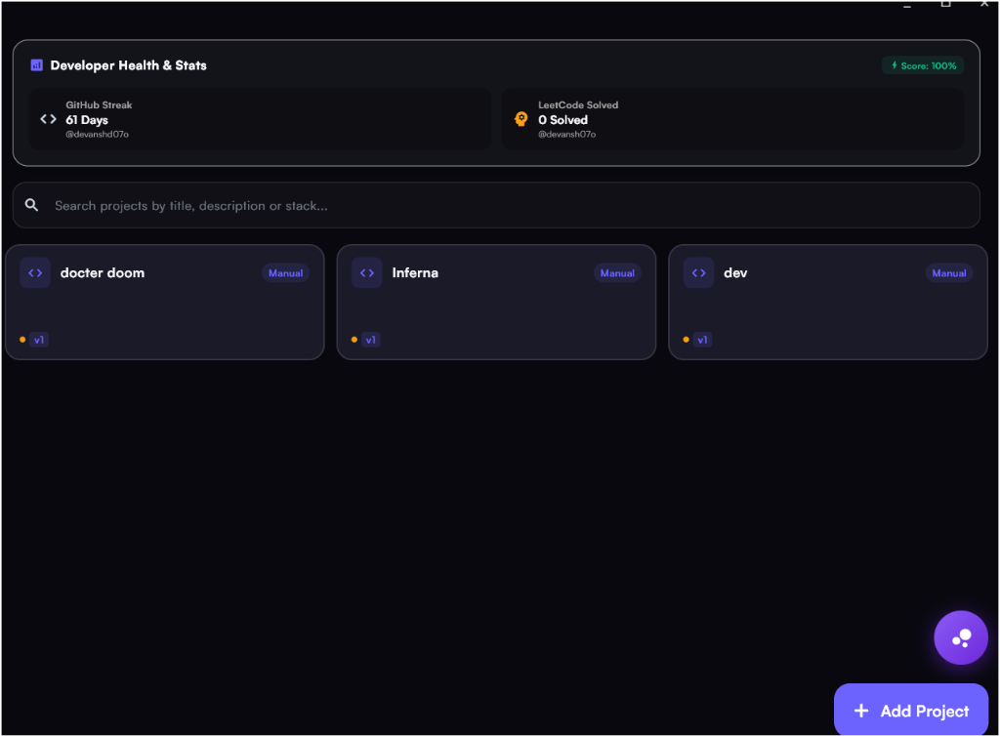

   
  
   
   

  <h1>Memorrow</h1>

  
<strong>The Obsidian-Dark, Local-First Productivity & Engineering OS</strong>

  

    <a href="#the-problem--overview">Overview</a> •
    <a href="#key-architecture-highlights">Architecture</a> •
    <a href="#deep-dive-engine">Engine Deep-Dive</a> •
    <a href="#signature-feature-spotlight">Signature Spotlight</a> •
    <a href="#privacy--security-philosophy">Privacy</a> •
    <a href="#release-timeline--roadmap">Roadmap</a>
  

  

    
    
    
  

   

---

## 📖 The Problem & Overview

Modern developers and power users are overwhelmed by fragmented productivity workflows. Critical tasks, LeetCode progress, project vaults, roadmap trackers, and AI assistants live across dozens of browser tabs and SaaS subscriptions. Furthermore, traditional productivity software heavily relies on cloud APIs—introducing **latency, privacy risks, and complete breakage when offline**.

**Memorrow** is engineered as a zero-compromise, cross-platform personal productivity OS for **Windows, macOS, Android, and iOS**. 

Built from the ground up on a **Local-First architecture**, Memorrow stores 100% of user data in high-performance local SQLite databases (`Drift`), providing instant sub-millisecond UI interactions and total offline autonomy. Cloud synchronization operates exclusively in the background through **Google Drive AppData**, ensuring zero vendor lock-in, zero external server tracking, and maximum user privacy.

---

## ⚡ Key Architecture Highlights

| Architectural Feature | Traditional SaaS Productivity Tools | Memorrow OS Architecture |
| :--- | :--- | :--- |
| **Data Ownership** | Stored on centralized third-party servers | **100% Local-First** (`Drift` / SQLite + AppData sync) |
| **Offline Functionality** | Broken or read-only | **Full Read/Write Autonomy** with instant local disk persistence |
| **Desktop OAuth Security** | Embedded client secrets or web redirects | **Zero-Client-Secret PKCE** via local loopback server |
| **Multi-Key AI Orchestration** | Fixed single API key bottleneck / Rate limits | **Atomic Parallel Race Load Balancer** across 50+ AI keys |
| **Cross-Device Sync** | Prone to duplicate item resurrection | **Tombstone Hard-Purge Sync** (`vault_v2_data_` array wipe) |
| **Mobile Integration** | Manual refresh / Passive web app | **Native Kotlin Reactive Widget Sync** for real-time state |

---

## 🛠️ Deep-Dive Engine & System Architecture

Memorrow follows a strict, audited **Clean Architecture Layering Protocol** across all supported desktop and mobile targets:

### Stage-by-Stage Data Flow Pipeline

1. **Local-First Execution Loop**: Any action (creating notes, marking roadmap targets, updating projects) writes instantly to local disk storage (`AppDatabase`). UI updates synchronously in **< 2 milliseconds**.
2. **Background Sync Engine**: Asynchronously checks local modified timestamps against the secure Google Drive AppData container (`vault_v2_data_$userId.json`). Changes are merged cleanly without blocking the UI.
3. **Zero-Resurrection Purge System**: Deletions perform direct array memory wipes (`removeWhere`), preventing tombstone resurrection across multi-device sync loops.

---

## 🌟 Signature Feature Spotlight

### 1. Multi-Key AI Load Balancer & Atomic Parallel Race

Memorrow features an advanced AI Orchestrator capable of pooling and managing **50+ API keys simultaneously** across multiple frontier providers (Groq, Gemini, Cerebras).

  
  
<em>Figure 1: Multi-Key API Management Interface supporting 50+ concurrent keys with auto-eviction.</em>

* **Atomic Parallel Race**: Fires user prompts across 5 active keys concurrently. The fastest responding key (~150-250ms) wins instantly while slower requests auto-cancel.
* **Instant 429 Cooldown Eviction**: If any single key encounters a rate limit, it receives an automatic 15-second cooldown block while the orchestrator instantly routes requests to remaining active keys.
* **Safe Mutex Lock**: Tool executions are protected by an atomic lock wrapper, guaranteeing zero duplicate note creations or navigation triggers during parallel key races.

---

### 2. Vault & Developer Health System

Organize codebases, credentials, private notes, and startup ideas inside a secure, encrypted Vault interface with real-time statistics tracking.

  
  
<em>Figure 2: Memorrow Vault & Developer Health Stats Showcase.</em>

* **LeetCode & GitHub Sync**: Automatic LeetCode slug matching and streak monitoring.
* **DSA Accordion Hierarchy**: Topic → Subtopic → Problem navigation designed specifically for technical interview preparation.
* **Glassmorphic Aesthetic**: Obsidian-dark semi-transparent panels, micro-animations, and backdrop blur.

---

## 🔒 Privacy & Security Philosophy

* **Zero-Telemetry Policy**: Memorrow collects zero user analytics, zero telemetry data, and zero behavioral metrics.
* **Zero-Client-Secret Desktop OAuth**: Desktop authentication (Windows/macOS) uses PKCE authorization code grant with a local loopback server (`http://127.0.0.1:<random-port>/oauth2redirect`). No client secrets are hardcoded or compiled into binaries.
* **Isolated Cloud Container**: Cloud backups live exclusively inside your personal Google Drive `appDataFolder`—invisible to other applications and strictly isolated to your authenticated account.

---

## 🗺️ Release Timeline & Roadmap

- [x] **v1.0.0 — Core Architecture**: Drift/SQLite local persistence + Clean Layering setup.
- [x] **v1.2.0 — Cloud Sync**: Background Google Drive AppData synchronization.
- [x] **v1.4.0 — Zero-Secret Auth**: Desktop PKCE Loopback OAuth2 integration.
- [x] **v1.6.0 — Multi-Key AI Engine**: Atomic Parallel Race & 50+ key load balancing.
- [ ] **v1.8.0 — Native Headless Sync**: Background OS daemon for Windows & macOS.
- [ ] **v2.0.0 — Public Release**: Multi-device public beta launch across Desktop & Mobile.

---

## 📄 License

This repository contains public showcase documentation and product specifications for **Memorrow**. 

Distributed under the **MIT License**. See `LICENSE` for more information.

---

  Built with passion for high-performance software craftsmanship.

